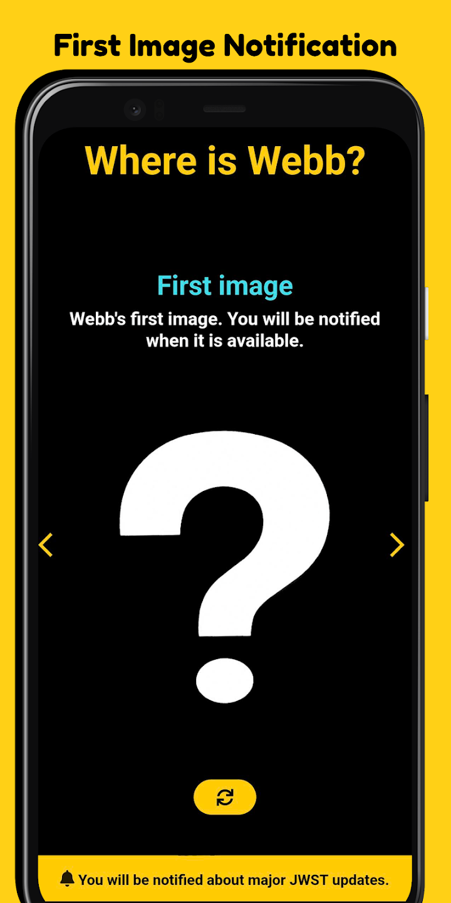

<h1 align=center>Where is Webb?</h1>

An android app that keeps you up to date about the James Webb Space Telescope via push notifications.

  
  
  

## Install

Available on the [play store](https://play.google.com/store/apps/details?id=com.pertl.johannes.jwst_status).

## How it works

The app scrapes data from the [official NASA website](https://www.jwst.nasa.gov/content/webbLaunch/whereIsWebb.html) and
displays it in a mobile-friendly way.  
It also sends a push notification as soon as a new step has been reached.

## Dependencies

* Flutter
* Node.js
* Firebase

## Setup

`flutter create .`  
`flutter run`
